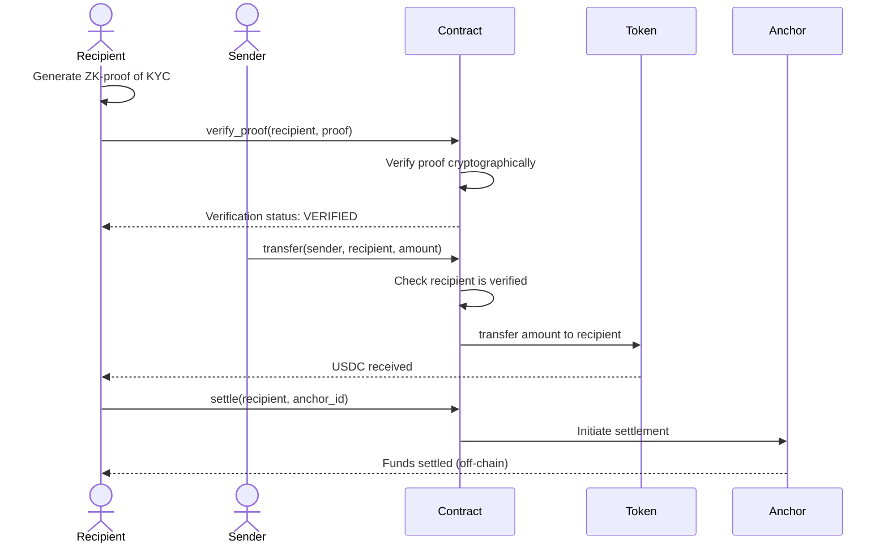

# ShadowPay — Privacy-Preserving Compliance Layer

> Confidential institutional payments powered by Zero-Knowledge proofs — built on Stellar Soroban.

Platform: Stellar Soroban | Language: Rust | License: MIT

[](https://github.com/your-org/ShadowPay/actions/workflows/ci.yml)
[](https://codecov.io/gh/your-org/ShadowPay)

---

## About

ShadowPay is a privacy-preserving compliance middleware for institutional payments on Stellar. It solves the fundamental tension between privacy and regulatory oversight by using **Zero-Knowledge (ZK) proofs** to verify that a recipient is authorized to receive funds without exposing their identity or transaction history to the public ledger.

Traditional blockchain payments force a choice: transparency (and regulatory compliance) or privacy. ShadowPay enables both. Recipients prove they are "verified/authorized" via ZK-proof — the compliance requirement is satisfied without compromising confidentiality. Institutions get the regulatory green light; users keep their financial privacy.

This platform is designed for banks targeting underserved markets, fintech teams building compliant payment rails, and enterprises exploring confidential transfers on Stellar.

---

## Table of Contents

- [Quick Start](#quick-start)
- [How It Works](#how-it-works)
- [Project Structure](#project-structure)
- [Setup Instructions](#setup-instructions)
- [Stellar Integration](#stellar-integration)
- [Testing](#testing)
- [Deployment](#deployment)
- [Architecture](#architecture)
- [Error Reference](#error-reference)
- [Contributing](#contributing)

---

## Quick Start

```bash
# Clone the repository
git clone https://github.com/your-org/ShadowPay.git
cd ShadowPay

# Build the contract
cd ShadowPay
cargo build --target wasm32-unknown-unknown --release

# Run tests
cargo test
```

---

## How It Works

### 1. ZK-KYC Verification
A recipient generates a Zero-Knowledge proof that proves they are authorized (KYC-verified) without revealing their identity or verification details to the ledger.

### 2. Proof Submission
The recipient submits the ZK-proof to the ShadowPay contract. The contract verifies the proof cryptographically.

### 3. Confidential Transfer
Once verified, the sender can transfer USDC (or other assets) to the recipient. The transaction is recorded on-chain, but the recipient's identity remains private.

### 4. Anchor Integration
The contract integrates with existing Stellar Anchors (e.g., MoneyGram) to enable real-world settlement while maintaining privacy.

| Stage | Privacy | Compliance |
|-------|---------|-----------|
| Proof Generation | ✅ Identity hidden | ✅ Verified status proven |
| Proof Verification | ✅ No ledger exposure | ✅ Regulatory requirement met |
| Transfer | ✅ Recipient anonymous | ✅ Authorized recipient only |
| Settlement | ✅ Off-chain privacy | ✅ Anchor compliance |

### The ZK Innovation

Traditional KYC requires identity disclosure. ShadowPay uses ZK-proofs to decouple verification from identity:

- **Prover** (recipient): "I am KYC-verified" (without saying who they are)
- **Verifier** (contract): Cryptographically confirms the proof is valid
- **Ledger**: Records only that a valid proof was submitted — not the identity

This is the "holy grail" for institutional payments: compliance without surveillance.

---

## Project Structure

```
ShadowPay/
├── ShadowPay/
│   ├── Cargo.toml          # Contract crate (Soroban SDK)
│   └── src/
│       └── lib.rs          # Contract: verify_proof, transfer, settle
├── Cargo.toml              # Workspace root
└── README.md               # This file
```

**Key contract entry points:**

| Function | Description |
|---|---|
| `initialize(deployer, admin, token)` | One-time setup — deployer must sign; sets admin and USDC token address |
| `verify_proof(recipient, proof)` | Verify a ZK-proof of KYC authorization |
| `transfer(sender, recipient, amount)` | Transfer USDC to a verified recipient |
| `settle(recipient, anchor_id)` | Settle funds via an Anchor (e.g., MoneyGram) |
| `get_verification_status(recipient)` | Check if a recipient is verified |

---

## 🛡️ Access Control Matrix

| Function | Role Required | Description | Impact |
|---|---|---|---|
| `initialize` | **Deployer** | One-time setup of Admin and Token addresses. | Sets security foundation. |
| `verify_proof` | **Recipient** | Submit ZK-proof of KYC authorization. | Enables confidential transfers. |
| `transfer` | **Sender** | Send USDC to verified recipient. | Disburses capital privately. |
| `settle` | **Recipient** | Settle funds via Anchor. | Real-world settlement. |
| `get_verification_status` | **Anyone** | Check recipient verification status. | Transparency (no identity leaked). |

---

## Setup Instructions

### Requirements

- Rust (latest stable)
- Stellar CLI (`stellar-cli`)
- A Stellar account (for deployment)

### 1. Install Rust

```bash
curl --proto '=https' --tlsv1.2 -sSf https://sh.rustup.rs | sh
rustup target add wasm32-unknown-unknown
```

### 2. Install Stellar CLI

```bash
cargo install --locked stellar-cli
stellar --version
```

### 3. Configure Networks

```bash
# Testnet (recommended for development)
stellar network add testnet \
  --rpc-url https://soroban-testnet.stellar.org:443 \
  --network-passphrase "Test SDF Network ; September 2015"

# Mainnet
stellar network add mainnet \
  --rpc-url https://rpc.mainnet.stellar.org:443 \
  --network-passphrase "Public Global Stellar Network ; September 2015"
```

### 4. Environment Variables

Create a `.env` file (never commit this):

```bash
NETWORK=testnet
DEPLOYER_SECRET_KEY="SB..."   # Your deployer secret key
ADMIN_ADDRESS="GB..."         # Admin account address
TOKEN_CONTRACT="..."          # USDC token contract address
```

> ⚠️ Add `.env` to your `.gitignore`. Never commit secret keys.

---

## Stellar Integration

### Overview

ShadowPay integrates with Stellar's Soroban smart contract platform to enable privacy-preserving payments. The contract interacts with:

- **Soroban Host**: Executes ZK-proof verification and state management
- **Stellar Token Contract**: Manages USDC transfers (SEP-41 standard)
- **Anchors**: Enable real-world settlement (e.g., MoneyGram, Wise)

### Contract Deployment

The contract is deployed as a WASM binary to Stellar's Soroban network:

```bash
# Build WASM
cargo build --target wasm32-unknown-unknown --release

# Deploy to testnet
stellar contract deploy \
  --wasm target/wasm32-unknown-unknown/release/shadow_pay.wasm \
  --network testnet \
  --source $DEPLOYER_SECRET_KEY
```

### Token Integration

The contract uses Stellar's native token interface (SEP-41) to:

1. **Transfer USDC** - Call the token contract's `transfer` function
2. **Check Balances** - Query token contract for recipient balances
3. **Approve Spending** - Request authorization for token transfers

### Anchor Settlement

After a confidential transfer, recipients can settle funds via anchors:

```rust
// Settle via anchor (e.g., MoneyGram)
settle(recipient, anchor_id)
```

Anchors handle:
- Off-chain fund delivery
- KYC verification (optional, already done via ZK-proof)
- Currency conversion
- Compliance reporting

### Network Configuration

| Network | RPC URL | Passphrase |
|---------|---------|-----------|
| Testnet | `https://soroban-testnet.stellar.org:443` | `Test SDF Network ; September 2015` |
| Mainnet | `https://rpc.mainnet.stellar.org:443` | `Public Global Stellar Network ; September 2015` |

---

## Testing

```bash
# Run all tests
cd ShadowPay
cargo test

# Run with output
cargo test -- --nocapture

# Run a specific test
cargo test test_verify_proof_and_transfer
```

**Test coverage:**

| Test | Verifies |
|---|---|
| `test_verify_proof_and_transfer` | ZK-proof verified, transfer executed to recipient |
| `test_invalid_proof_rejected` | Invalid proof is rejected; transfer blocked |
| `test_unverified_recipient_blocked` | Transfer to unverified recipient fails |
| `test_unauthorized_initialize_rejected` | `initialize` panics when called without deployer's signature |

---

## Deployment

### Security: Deployer-Gated Initialization

`initialize` requires the `deployer` address to sign the transaction (`deployer.require_auth()`). This prevents front-running attacks between deployment and initialization.

**Required deployment sequence — do not deviate:**

```
Step 1: Build the WASM
Step 2: Deploy the contract  ← deployer keypair signs this tx
Step 3: Initialize the contract ← SAME deployer keypair must sign this tx
```

### Deploy to Testnet

```bash
# Build
cargo build --target wasm32-unknown-unknown --release

# Step 1 — Deploy (note the returned CONTRACT_ID)
stellar contract deploy \
  --wasm target/wasm32-unknown-unknown/release/shadow_pay.wasm \
  --network testnet \
  --source $DEPLOYER_SECRET_KEY

# Step 2 — Initialize immediately after deploy, using the SAME source key
stellar contract invoke \
  --id $CONTRACT_ID \
  --fn initialize \
  --network testnet \
  --source $DEPLOYER_SECRET_KEY \
  -- \
  --deployer $DEPLOYER_ADDRESS \
  --admin $ADMIN_ADDRESS \
  --token $TOKEN_CONTRACT
```

### Deploy to Mainnet

> ⚠️ Production checklist before deploying:
> - [ ] All tests passing
> - [ ] Security audit completed
> - [ ] Testnet deployment verified
> - [ ] Admin keys secured (multisig recommended)
> - [ ] Token contract address confirmed
> - [ ] ZK-proof verification logic audited

```bash
stellar contract deploy \
  --wasm target/wasm32-unknown-unknown/release/shadow_pay.wasm \
  --network mainnet \
  --source $DEPLOYER_SECRET_KEY
```

---

## Architecture

```
Sender
   └── initiates transfer
         └── Privacy Shield (ZK-KYC)
               ├── Recipient generates ZK-proof
               ├── Proof submitted to contract
               ├── Contract verifies proof
               └── Proof valid → Transfer executed
                     ├── USDC transferred to recipient
                     └── Settlement via Anchor (optional)
```

### Privacy Flow



**Key concepts:**

- **Zero-Knowledge Proof:** Cryptographic proof of authorization without identity disclosure
- **Privacy Shield:** Frontend toggle enabling confidential transfers
- **Anchor Integration:** Real-world settlement while maintaining on-chain privacy
- **Regulatory Compliance:** Proof of KYC verification without ledger exposure

**Why Stellar?**

- Near-zero transaction fees — critical for institutional payments
- Fast finality (~5s) — practical for real-time settlement
- Soroban smart contracts — expressive enough for ZK-proof verification
- Native USDC support — seamless stablecoin transfers
- Anchor ecosystem — existing settlement infrastructure

---

## Error Reference

All contract errors are defined in `src/errors.rs` as the `ContractError` enum.

| Code | Variant | Trigger | Resolution |
|------|---------|---------|------------|
| 1 | `InvalidProof` | ZK-proof verification failed. | Ensure the proof is valid and correctly formatted. |
| 2 | `RecipientNotVerified` | Transfer attempted to unverified recipient. | Recipient must submit valid ZK-proof first. |
| 3 | `InsufficientFunds` | Sender balance is below transfer amount. | Ensure sender has sufficient USDC. |
| 4 | `ZeroAddress` | An admin or token address is the all-zeros Stellar address. | Provide a valid, non-zero address. |
| 5 | `UnauthorizedCaller` | `transfer` called by an address that is not the sender. | Ensure the transaction is signed by the sender. |
| 6 | `InvalidAmount` | Transfer amount is ≤ 0. | Specify a positive amount. |
| 7 | `AlreadyInitialized` | `initialize` called on a contract that has already been initialized. | `initialize` is one-time only; no action needed. |
| 8 | `ContractPaused` | Any state-mutating function called while the contract is paused. | Wait for an admin to call `unpause`. |
| 9 | `AnchorNotFound` | Settlement attempted with an invalid anchor ID. | Verify the anchor ID is registered. |
| 10 | `SettlementFailed` | Anchor settlement failed. | Contact the anchor provider. |

---

## API Reference

### Public Functions

#### Initialization & Admin

##### `initialize(deployer, admin, token)`
**Signature**: `fn initialize(env: Env, deployer: Address, admin: Address, token: Address) -> Result<(), ContractError>`

One-time contract initialization. Sets up the protocol with admin address and USDC token.

**Parameters**:
- `deployer`: Address that deployed the contract (must sign the transaction)
- `admin`: Admin address for governance
- `token`: USDC token contract address (must implement SEP-41)

**Errors**: `AlreadyInitialized`, `InvalidToken`, `ZeroAddress`

#### ZK-KYC Verification

##### `verify_proof(recipient, proof)`
**Signature**: `fn verify_proof(env: Env, recipient: Address, proof: Bytes) -> Result<(), ContractError>`

Verify a ZK-proof of KYC authorization. Recipient becomes eligible for confidential transfers.

**Parameters**:
- `recipient`: Address submitting the proof
- `proof`: ZK-proof bytes (must be valid)

**Errors**: `InvalidProof`

#### Transfers

##### `transfer(sender, recipient, amount)`
**Signature**: `fn transfer(env: Env, sender: Address, recipient: Address, amount: i128) -> Result<(), ContractError>`

Transfer USDC to a verified recipient. Recipient identity remains private on-chain.

**Parameters**:
- `sender`: Address sending USDC
- `recipient`: Address receiving USDC (must be verified)
- `amount`: Transfer amount in stroops

**Errors**: `RecipientNotVerified`, `InsufficientFunds`, `InvalidAmount`, `UnauthorizedCaller`

##### `settle(recipient, anchor_id)`
**Signature**: `fn settle(env: Env, recipient: Address, anchor_id: u32) -> Result<(), ContractError>`

Settle funds via an Anchor (e.g., MoneyGram). Off-chain settlement while maintaining privacy.

**Parameters**:
- `recipient`: Address settling funds
- `anchor_id`: Anchor provider ID

**Errors**: `AnchorNotFound`, `SettlementFailed`

#### Queries

##### `get_verification_status(recipient) -> bool`
**Signature**: `fn get_verification_status(env: Env, recipient: Address) -> bool`

Check if a recipient is verified for confidential transfers.

**Parameters**:
- `recipient`: Recipient address

**Returns**: True if verified

---

## Frequently Asked Questions (FAQ)

### Protocol

**What is ShadowPay?**
ShadowPay is a privacy-preserving compliance middleware that uses Zero-Knowledge proofs to verify KYC authorization without exposing recipient identity or transaction history to the public ledger.

**How does ZK-KYC work?**
Recipients generate a cryptographic proof that proves they are KYC-verified without revealing who they are. The contract verifies the proof. Once verified, transfers can proceed confidentially.

**Is this compliant?**
Yes. The contract verifies that a recipient is authorized (KYC-verified) before allowing transfers. Regulators see proof of compliance; users maintain privacy.

**Can I see who received the payment?**
No — that's the point. The ledger records that a valid proof was submitted and a transfer occurred, but not the recipient's identity.

**How do I integrate with an Anchor?**
Call `settle(recipient, anchor_id)` after transfer. The contract routes funds to the Anchor for real-world settlement (e.g., MoneyGram payout).

### Deployment

**How do I deploy to testnet?**
See the [Deployment](#deployment) section. The same keypair that signs the `deploy` transaction must also sign the `initialize` transaction.

**Can I upgrade the contract after deployment?**
Yes, via an admin upgrade function. It is recommended to pause the contract before upgrading.

**What network passphrase should I use?**
- Testnet: `"Test SDF Network ; September 2015"`
- Mainnet: `"Public Global Stellar Network ; September 2015"`

---

## Contributing

Contributions are what make the open-source community such an amazing place to learn, inspire, and create. Any contributions you make are **greatly appreciated**.

Please refer to [CONTRIBUTING.md](CONTRIBUTING.md) for our full guidelines on:
- Branch naming conventions
- Commit message formats (Conventional Commits)
- Pull Request workflow
- Testing and Style guides

---

## Roadmap

- [x] Core ZK-proof verification contract (Soroban)
- [x] USDC token transfers via Soroban token interface
- [x] Recipient verification status tracking
- [x] Admin-gated initialization with auth enforcement
- [ ] Anchor integration (MoneyGram, others)
- [ ] Privacy Shield frontend toggle
- [ ] Multi-asset support (USDC, other stablecoins)
- [ ] Regulatory reporting dashboard
- [ ] Mobile-first UI for institutional users

---

## Security

See [SECURITY.md](SECURITY.md) for the full vulnerability disclosure policy and contact information.

- Never commit `.env` files or secret keys
- Use hardware wallets or multisig for admin keys
- Report vulnerabilities privately via [GitHub Security Advisories](https://github.com/your-org/ShadowPay/security/advisories/new) — do not open public issues
- **Dependency Scanning**: `cargo audit` runs automatically in CI. Any high-severity vulnerability will fail the build.

---

## License

MIT

---

## Resources

- [Stellar Documentation](https://developers.stellar.org)
- [Soroban Docs](https://soroban.stellar.org)
- [Zero-Knowledge Proofs Primer](https://blog.cryptographyengineering.com/2014/11/27/zero-knowledge-proofs-illustrated-primer/)
- [Stellar Developer Discord](https://discord.gg/stellardev)
